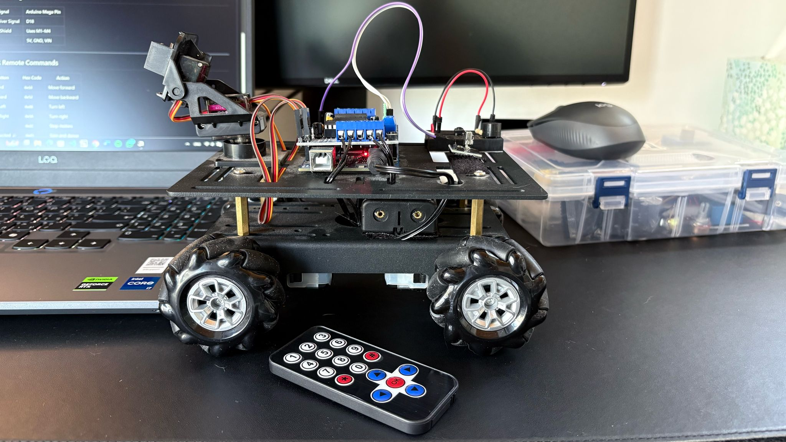

# 🤖 Arduino Mecanum Rover with IR Remote Control

An Arduino Mega-based rover project controlled by an IR remote, powered by the Adafruit Motor Shield (v1), featuring smooth motor acceleration and modular structure. Designed for fun, testing, and future expansion like obstacle detection or servo-camera control.

---

## 🚀 Features

- 🔁 IR remote control (forward, backward, left, right, stop, "excited mode")
- 💨 Smooth acceleration for forward motion
- 🧱 Modular codebase (main logic, motor functions, constants)
- 🧠 Designed for Adafruit Motor Shield v1 + Arduino Mega
- 🔌 Expandable for ultrasonic sensors, servos, and more

---

## 🧰 Hardware

| Component             | Details                        |
|-----------------------|--------------------------------|
| Arduino Mega          | Main controller                |
| Adafruit Motor Shield | v1, controls 4 DC motors       |
| IR Receiver Module    | Signal pin on **Pin 18**       |
| 4x DC Motors          | Mecanum or standard wheels     |
| Power Supply          | Separate motor power (recommended) |
| Optional              | Servo or ultrasonic modules    |

---

## 🛠 Pin Configuration

| Signal              | Arduino Mega Pin |
|---------------------|------------------|
| IR Receiver Signal  | D18              |
| Motor Shield        | Uses M1–M4       |
| Power               | 5V, GND, VIN     |

---

## 🧩 IR Remote Commands

| Button        | Hex Code | Action         |
|---------------|----------|----------------|
| Forward       | `0x18`   | Move forward   |
| Backward      | `0x52`   | Move backward  |
| Turn Left     | `0x08`   | Turn left      |
| Turn Right    | `0x5A`   | Turn right     |
| Stop          | `0x1C`   | Stop motors    |
| Get Excited 🎉 | `0x45`   | Spin and dance |

*(You can adjust codes to match your remote in `#define` values)*

---
## 📦 Libraries Used

### 🔹 [IRremote](https://github.com/Arduino-IRremote/Arduino-IRremote)
- Author: Armin Joachimsmeyer  
- Version: 4.x  
- Description: Decodes signals from standard IR remotes. Used to control the rover via buttons for forward, backward, stop, etc.

### 🔹 [Adafruit Motor Shield v1 Library](https://github.com/adafruit/Adafruit-Motor-Shield-library)
- Author: Adafruit Industries  
- Description: Allows control of DC motors and servos using the original Adafruit Motor Shield (v1). Used to control all four rover motors via M1–M4 channels.

